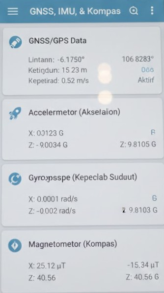

# 📰 Kompas Digital App

Proyek ini adalah aplikasi berita digital yang dibuat menggunakan **framework Flutter**.

Aplikasi ini bertujuan untuk menyajikan berita terbaru dengan desain yang responsif dan navigasi kategori yang mudah.

## 🖼️ Tampilan Aplikasi (Screenshots)

Berikut adalah tangkapan layar (screenshot) dari aplikasi:

---

## ⚙️ Fitur dan Teknologi

### Fitur Utama

* Menampilkan berita terbaru dari berbagai sumber.
* Navigasi kategori berita yang intuitif.
* Desain antarmuka (UI) yang bersih dan responsif.

### Teknologi

* **Framework:** Flutter (untuk pengembangan aplikasi *cross-platform*).

---

 Getting Started

This project is a starting point for a Flutter application.

 Persyaratan Sistem

Pastikan Anda sudah menginstal Flutter SDK.

Sumber Daya Awal

A few resources to get you started if this is your first Flutter project:

* [Lab: Write your first Flutter app](https://docs.flutter.dev/get-started/codelab)
* [Cookbook: Useful Flutter samples](https://docs.flutter.dev/cookbook)

For help getting started with Flutter development, view the [online documentation](https://docs.flutter.dev/), which offers tutorials, samples, guidance on mobile development, and a full API reference.
